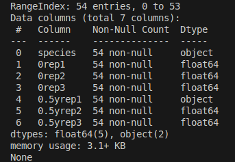
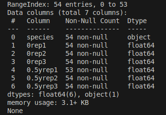
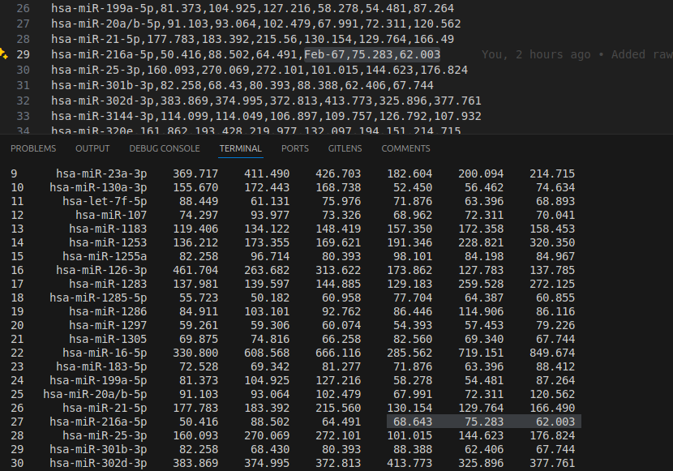

# Data Preparation
`DataFrame` information before data preparation has been completed:
\

\
Column #4 displays `Dtype` as an `object` and not `float64` as expected. 

---
**Lets force every column to its expected `float64` type and replace each non-numeric value with an `NaN`:**
```Python
[...]
numeric_columns = ["0rep1", "0rep2", "0rep3", "0.5yrep1", "0.5yrep2", "0.5yrep3"]

for column in numeric_columns:
	data_frame[column] = pd.to_numeric(data_frame[column], errors='coerce')
```

The `DataFrame` information now shows:
\

\
Showing us that is successfully replaced 1 incorrect value to an `NaN`, as we only have `53` `float64` values in row `#4` instead of `54` values.

---
**Fill incorrect `NaN` values with the mean of the row where the `NaN` exists (`0y` and `0.5y` seperated):**
```Python
[...]
rep0_df = data_frame[["0rep1", "0rep2", "0rep3"]].apply(row_mean, axis=1)
rep05_df = data_frame[["0.5yrep1", "0.5yrep2", "0.5yrep3"]].apply(row_mean, axis=1)

data_frame[["0rep1", "0rep2", "0rep3"]] = rep0_df
data_frame[["0.5yrep1", "0.5yrep2", "0.5yrep3"]] = rep05_df
```

The `DataFrame` information now shows:
\

\
Showing us that the `NaN` values have been successfully replaced with an `flaot64` value, since all columns now have `54` values of the correct `Dtype`.

Lets inspect the `DataFrame` to verify these changes:
\

\
As we can see, the `Feb-67` values has been automatically replaced with `68.643`, which correctly is the mean of `75.283` and `62.003`.

---