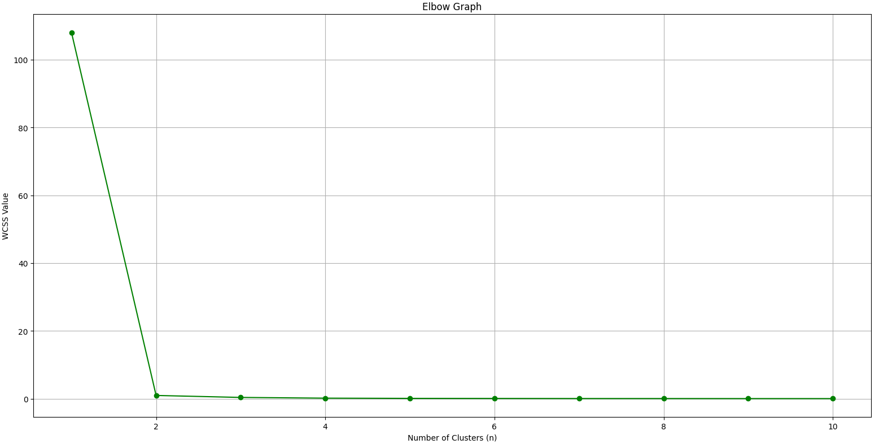
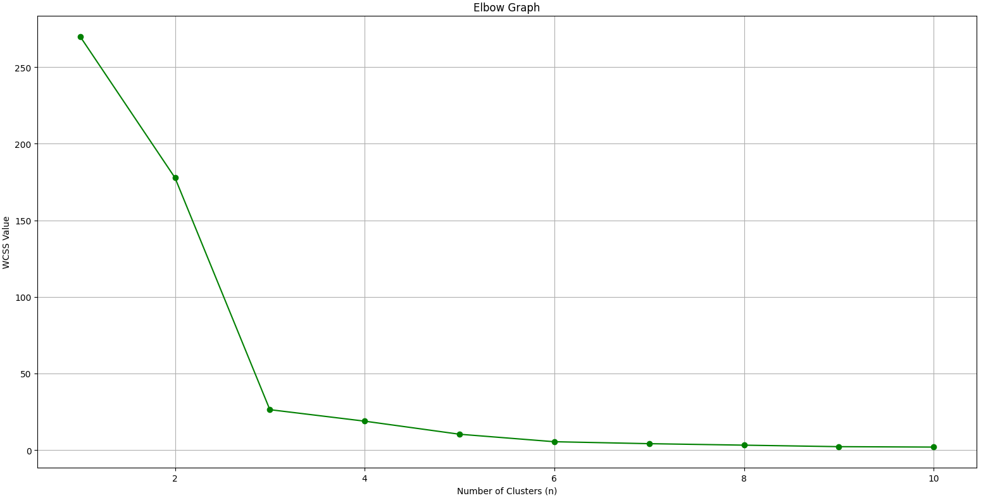

**Contents**:
- [Data Preparation](#Data-Preparation)
- [Elbow Method](#Elbow-Method)
	- [Feature Engineering](#Feature-Engineering)
---
# Data Preparation
`DataFrame` information before data preparation has been completed:
\

\
Column #4 displays `Dtype` as an `object` and not `float64` as expected.

---
**Lets force every column to its expected `float64` type and replace each non-numeric value with an `NaN`:**
```Python
numeric_columns = ["0rep1", "0rep2", "0rep3", "0.5yrep1", "0.5yrep2", "0.5yrep3"]

for column in numeric_columns:
	mirna_df[column] = pd.to_numeric(data_frame[column], errors='coerce')
```

The `DataFrame` information now shows:
\

\
Showing us that the incorrect value has been replaced with a `NaN`, as we only have `53` `float64` values in row `#4` instead of `54` values.

---
**Fill empty `NaN` values with the mean of the row where the `NaN` exists (for `0y` and `0.5y` separately):**
```Python
year0_df = mirna_df[["0rep1", "0rep2", "0rep3"]].apply(row_mean, axis=1)
year05_df = mirna_df[["0.5yrep1", "0.5yrep2", "0.5yrep3"]].apply(row_mean, axis=1)
```

The `DataFrame` information now shows:
\

\
Showing us that the `NaN` values have been successfully replaced with an `flaot64` value, since all columns now have `54` values of the correct `Dtype`.
  
Lets inspect the `DataFrame` to verify these changes:
\

\
As we can see, the `Feb-67` value has been automatically replaced with `68.643`, which is the mean of `75.283` and `62.003`.

---
Now we have a complete dataset with no empty or incorrect values, we can prepare the data for clustering. First we calculate the mean of each row and combine the separate columns back into one mean-manipulated `DataFrame`. 
```Python
year0_mean = year0_df.mean(axis=1)
year05_mean = year05_df.mean(axis=1)
 
mean_mirna_df = pd.DataFrame({"0_year": year0_mean, "0.5_year": year05_mean})
```

The mean-manipulated `DataFrame` looks like this:
\

\
After combining the measurements into a single mean value for each row, we can then normalize the data by scaling them around the mean and standard deviation. After fitting and transforming the scaling to the `DataFrame`, we have completed our Data Preparation:
```Python
scaler = StandardScaler()
scaled_array = scaler.fit_transform(mean_mirna_df)

mirna_df = pd.DataFrame(scaled_array, columns=mean_mirna_df.columns, index=mean_mirna_df.index)
```

After the normalization, the final prepared `DataFrame` looks like this:
\


---
# Elbow Method
Since we have chosen to use the `K-means` algorithm, we need to define the number of clusters we want to use. We do not know what the optimal number of clusters are in this scenario, so we need to calculate it. One of the ways to calculate the optimal number of clusters, is to use the `Elbow Method`.

The `Elbow Method` analyzes *Within-Cluster Sum of Squares* (`WCSS`) through a number of clusters, to find the most optimal number. 

---
**Before we calculate the `WCSS` values, we initialize an empty list to store the calculated values and define a range of `n`-numbers we want to evaluate the `WCSS` value for:**
```Python
wcss = []
range_clusters = range(1, 11)
```

To calculate the `WCSS` value for each number in the range defined, we need to fit the `K-means` model to our `DataFrame` and calculating the `WCSS` value for each count:
```Python
for n in range_clusters:
	k_means = KMeans(n_clusters=n, init='k-means++', random_state=24)
	k_means.fit(mirna_df)
	wcss.append(k_means.inertia_)
```

After this we can plot the `Elbow Graph` and analyze it to find the most optimal number of clusters for our `K-mean` model. 

**Attempt #1:**
\

\
This is not the wanted output since there are no *elbow-point* on the `Elbow Graph`. We need to modify something if we want to continue using `K-means`. There are probably many possible reasons why this failed, but let's try to feature engineer this problem away.

## Feature Engineering
By utilizing the process of `Feature Engineering`, one can create new and informative features based on the existing dataset in possession. This can help to increase the variance to better the distance between groups or clusters. 

In our context we want to find the `miRNA` species with the largest deregulation from `0y` to `0.5y`. So, we are basically interested in the difference in value from the start to the end. From this we can feature engineer up some new features that will help our model provide a valid performance. To hopefully improve the variance in our model and help us pick out a valid cluster-number from the `Elbow Graph`. **Let's try to add the *difference*, *ratio* and *percentage* change between the measurements to reinforce the change in value:**
```Python
mean_mirna_df['difference'] = mean_mirna_df['0.5_year'] - mean_mirna_df['0_year']
mean_mirna_df['ratio'] = mean_mirna_df['0.5_year'] / mean_mirna_df['0_year']
mean_mirna_df['percent_change'] = (mean_mirna_df['0.5_year'] - mean_mirna_df['0_year']) / mean_mirna_df['0_year'] * 100
```

**Attempt #2:**
\

\
This is a much better looking `Elbow Graph` than we had in **Attempt #1**. Here we can clearly see an elbow-looking graph, with the *elbow-point* at `n=3`. Since after `n=3` the graph slows down and looses its curve and almost decreases linearly for the rest of the cluster-counts, the *elbow-point* and optimal number of cluesters is `n=3`.

---
