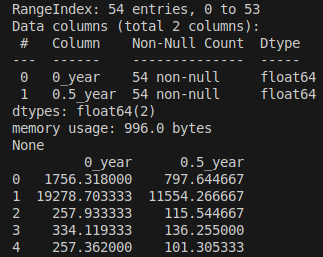

**Contents**:
- [Data Preparation](#Data-Preparation)
	- [Feature Engineering](#Feature-Engineering)
- [Isolation Forest](#Isolation-Forest)
	- [Output](#Output)
	- [Evaluation](#Evaluation)
---
# Data Preparation
`DataFrame` information before data preparation has been completed:
\

\
Column #4 displays `Dtype` as an `object` and not `float64` as expected.

---
**Lets force every column to its expected `float64` type and replace each non-numeric value with an `NaN`:**
```Python
numeric_columns = ["0rep1", "0rep2", "0rep3", "0.5yrep1", "0.5yrep2", "0.5yrep3"]

for column in numeric_columns:
	mirna_df[column] = pd.to_numeric(data_frame[column], errors='coerce')
```

The `DataFrame` information now shows:
\

\
Showing us that the incorrect value has been replaced with a `NaN`, as we only have `53` `float64` values in row `#4` instead of `54` values.

---
**Fill empty `NaN` values with the mean of the row where the `NaN` exists (for `0y` and `0.5y` separately):**
```Python
year0_df = mirna_df[["0rep1", "0rep2", "0rep3"]].apply(row_mean, axis=1)
year05_df = mirna_df[["0.5yrep1", "0.5yrep2", "0.5yrep3"]].apply(row_mean, axis=1)
```

The `DataFrame` information now shows:
\

\
Showing us that the `NaN` values have been successfully replaced with an `flaot64` value, since all columns now have `54` values of the correct `Dtype`.
  
Lets inspect the `DataFrame` to verify these changes:
\

\
As we can see, the `Feb-67` value has been automatically replaced with `68.643`, which is the mean of `75.283` and `62.003`.

---
Now we have a complete dataset with no empty or incorrect values, we can prepare the data for training. First we calculate the mean of each row and combine the separate columns back into one mean-manipulated `DataFrame`. 
```Python
year0_mean = year0_df.mean(axis=1)
year05_mean = year05_df.mean(axis=1)
 
mean_mirna_df = pd.DataFrame({"0_year": year0_mean, "0.5_year": year05_mean})
```

The mean-manipulated `DataFrame` looks like this:
\


## Feature Engineering
By utilizing the process of `Feature Engineering`, one can create new and informative features based on the existing dataset in possession. This can help to increase the variance to better improve the effectiveness of our model.

In our context we want to find the `miRNA` species with the largest deregulation from `0y` to `0.5y`. So, we are basically interested in the difference in value from the start to the end. From this we can feature engineer up some new features that will help our model provide a valid performance. 

**We can add the *difference* and *percentage* change between the measurements to reinforce our model:**
```Python
mean_mirna_df['difference'] = mean_mirna_df['0.5_year'] - mean_mirna_df['0_year']
mean_mirna_df['percent_change'] = (mean_mirna_df['0.5_year'] - mean_mirna_df['0_year']) / mean_mirna_df['0_year'] * 100
```

---

After combining the measurements into a single mean value for each row and feature engineering, we can then normalize the data by scaling them around the mean and standard deviation. After fitting and transforming the scaling to the `DataFrame`, we have completed our Data Preparation:
```Python
scaler = StandardScaler()
scaled_array = scaler.fit_transform(mean_mirna_df)

mirna_df = pd.DataFrame(scaled_array, columns=mean_mirna_df.columns, index=mean_mirna_df.index)
```

After the normalization, the final prepared `DataFrame` looks like this:
\


---
# Isolation Forest
`Isolation Forest` if effective at detecting anomalous or outlying values in data. It utilizes `Isolation Trees`, a type of `Binary Tree`, that isolates points thought the dataset. It bases itself on the consent of that anomalies are easier to isolate because they are far from the populated regions of data. By creating several `Isolation Trees` where each of them divides data until all observations are isolated, it can detect anomalies because they need fewer splits to isolate because of their anomalous nature.

In this context if fits quite well since deregulated `miRNA` species are outliers compared to the majority that has smaller changes. The species with a high magnitude of deregulation are anomalies. `Isolation Forest` is also unsupervised, so we do not have the need to label our data it can discover the outliers on its own.

**We can apply `Isolation Forest` to our code like this:**
```Python
isolation_forest = IsolationForest(n_estimators=100,
				   contamination=0.05,
				   random_state=24)

mirna_df['anomaly_score'] = isolation_forest.fit_predict(mirna_df)
```
**`IsolationForest`**
- **`n_estimators=100`:** Number of trees in the forest. Higher number give more robust detection at the cost of computation time. `100` is satisfactory.
- **`contamination=0.05`:** Expect `5%` of observations to be outliers. Higher value could lead to false-positives, lower could be restrictive.
- **`random_state=24`:** Fixed randomness so we can reproduce during development.
**`isolation_forest.fit_predict`**
- **`fit`:** Train the model on the `DataFrame`. Each tree split data points along features.
- **`predict`:** Assigns an anomaly score to each observation. Where `-1` is an anomaly and `1` normal.

**To review our results we will need to filter out the normal rows and only keep the anonymous rows:**
```Python
sorted_mirna_df = mirna_data_frame.sort_values(by='percent_change',
						key=abs,
						ascending=False)
anon_mirna_df = sorted_mirna_df[sorted_mirna_df['anomaly_score'] == -1]
```

**We will also retrieve the actual `miRNA` species names to understand our output better:**
```Python
def replaceIndexWithName(sorted_mirna_df):
    sorted_mirna_df.index.name = 'miRNA_species'
    return sorted_mirna_df.reset_index()
    
anon_mirna_df = replaceIndexWithName(anon_mirna_df)
print(anon_mirna_df)
```
---
## Output
After preparing our output we are left whit this:
\

\
Here we have our top 3 most deregulated `miRNA` species sorted by the highest magnitude of percentage changed.

---
## Evaluation
To evaluate our model we calculate the expected count and percentage of anomalies with the actual values. We will also plot a scattered graph highlighting the anonymous values together with the normal values based on their percentage change value.
```Python
total_count = len(mirna_df)
expected_anomalies = total_count * containment_rate
anomaly_count = len(mirna_df[mirna_df['anomaly_score'] == -1])
normal_count = total_count - anomaly_count
```
**Expected vs actual values:**
\

\
**Scatter graph:**
\

---
